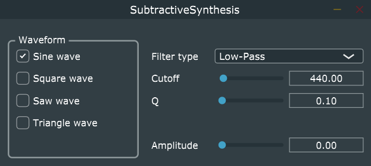
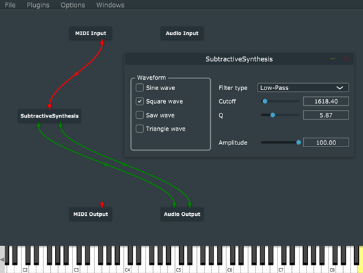

# HOMEWORK 2 REPORT
Assignment 2: Subtractive synthesis

Group 17 - Jacopo Caucig, Hakim El Achak, Laura Lodetti, Fabio Spreafico

## Goal of the assignment

The goal of this assignment is to implement a synthesizer based on subtractive synthesis using JUCE. As such, the synthesizer will be based on two blocks: a waveform generator and a filter.
The frequency of the waveform will be controlled by a MIDI input while the output will be the filtered waveform. The GUI should allow the user to select the waveform type, the quality factor and the cutoff frequency of the filter.

To implement this synthesizer, the JUCE framework will be used as well as the DSP module to help with the implementation of the filters and the Audio Processor Value Tree State for sharing parameters contained in the GUI between Editor and Processor.

## Implementation

We will proceed by going through our code, starting with the editor and ending with the processor while explaining our decisions.

### Plugin Editor.h

We start by declaring all the sliders, buttons and labels that will be used on the GUI in the editor header. We decided to give the user the possibility to control the type of the waveform through a GroupComponent containing the buttons corresponding to each waveform available. In addition to that, the user will be able to select the filter type through a drop-down menu and the signal amplitude, cutoff frequency and quality factor through sliders. After the declaration, for each object, we create a unique pointer that will be used to observe that single element.

### Plugin Editor.cpp

In the cpp file of the editor, all the controls of the GUI are set and defined. For the sliders, the range is set according to the parameter they controlled (from 20 to 20 000 for the cutoff frequency, from 0.10 to 20.00 for the Q factor and from 0 to 100 for the amplitude) and the style is set to LinearHorizonal. Since all the buttons belong to the same group, only one of them can be selected at the same time, avoiding thus errors due to having multiple waveforms selected at the same time. All the filter types are added to the filter drop-down menu and the low-pass filter is set to be the default.
After setting all the parameters, each element is added to the GUI with the “addAndMakeVisible” command, and the attachments created in the header file are instantiated and linked the value tree state.
In the resized function, all the elements of the GUI are given a size and position. Here is the result:

### PluginProcessor.h

In the PluginProcessor header file are declared all the variables, functions, objects, and classes used in the cpp file. In the Public section the Audio Processor Value Tree State class is declared as well the “createParameters” function. They are used to establish the communication between editor and processor.

In the private section are declared the “StateVariableTPTFilter”, which is a dsp module that allows the use of IIR filter and controlling their parameters, and the gain which is used to control the amplitude. After that, the DSP Oscillator object is declared with all the waveforms that will be used: sine, square, triangle and saw.

Finally, all the variables and functions that will be used in the cpp file are declared.

### PluginProcessor.cpp

In the constructor is declared a AudioProcessorValueTreeState state object that allows us to set up all the parameters that will be used in the process.
Let us explain first the functions that will be used in the prepare to play and process blocks:

-	The “createParameters” function create a vector called parameters and pushes in it all the parameters to be retrieved from the editor using unique pointers.

-	The “updateParametersOsc” function updates the frequency and gain of all oscillators

-	The “updateParametersFilter” functions updates the cutoff frequency and quality factor of the filter, as well as the type of the filter using the following function.

-	The “setType” function is used to change the type of filter applied to the signal.

Starting from the “prepareToPlay” function, the DSP ProcessSpec is initialized with the current samples per block, sample rate, and the number of channels. After that, the filter and oscillator are initialized with the prepare and reset functions, the oscillator’s initial frequency is set to 440Hz and the gain is initially set to 0.
Then, moving to process block, the number of input and output channels is retrieved, and the buffer is cleared for each channel. After that, an audio block object is created with the purpose of being a container for the input buffer and then is connected to a “processContextReplacing” object that will be used for all processes.
Then, all the parameters from the pointers in the Value Tree State are retrieved and saved into variables, the note value is obtained from the midi buffer messages, and the oscillator and amplifier are updated with the “updateParametersOsc” function. In the end, the filter state is updated with the “updateParametersFilter” function and processed in the context block.

## Result and comments

After building the plugin and running it on JUCE Plug-in Host, the plugin seems to work well with all the available waveforms and filter types.

